<div align="center">

# 🌱 Agro Forte — Agrinho 2026

### Equilíbrio entre produção e meio ambiente

_Site interativo educacional para o Concurso Agrinho 2026_

---

</div>

<div align="center">

[](https://developer.mozilla.org/pt-BR/docs/Web/HTML)
[](https://developer.mozilla.org/pt-BR/docs/Web/CSS)
[](https://developer.mozilla.org/pt-BR/docs/Web/JavaScript)
[](https://developer.mozilla.org/pt-BR/docs/Web/Progressive_web_apps)

[](https://www.sistemafaep.org.br/agrinho/)


<br>


<br>


</div>

---

<div align="center">

### 🌐 Acesse o site publicado

[](https://jaog1v1.github.io/agrinho-2026/)

**🔗 [https://jaog1v1.github.io/agrinho-2026/](https://jaog1v1.github.io/agrinho-2026/)**

</div>

---

> 🌱 _"Agro forte, futuro sustentável: equilíbrio entre produção e meio ambiente"_

Site interativo educacional desenvolvido para o **Concurso Agrinho 2026**, na **Categoria Programação — Subcategoria 3 (Front-End)**, promovido pelo **SENAR-PR** (Serviço Nacional de Aprendizagem Rural) em parceria com a **SEED-PR** (Secretaria de Estado da Educação do Paraná).

---

## 📋 Sumário

- [✍️ Autoria](#️-autoria)
- [🎯 Objetivo do Tema Agrinho](#-objetivo-do-tema-agrinho)
- [🛠️ Tecnologias Utilizadas](#️-tecnologias-utilizadas)
- [📁 Estrutura do Projeto](#-estrutura-do-projeto)
- [⚡ Funcionalidades](#-funcionalidades)
- [📸 Capturas de Tela](#-capturas-de-tela)
- [⚙️ Otimizações Técnicas](#️-otimizações-técnicas)
- [🔦 Auditoria Lighthouse](#-auditoria-lighthouse)
- [📱 Cobertura Responsiva Universal](#-cobertura-responsiva-universal)
- [🚀 Como Executar](#-como-executar)
- [✅ Conformidade com o Regulamento](#-conformidade-com-o-regulamento)
- [🌐 Compatibilidade](#-compatibilidade)
- [🏆 Sobre o Concurso](#-sobre-o-concurso)
- [💭 Reflexão do Estudante](#-reflexão-do-estudante)
- [🎨 Créditos](#-créditos)
- [📜 Licença](#-licença)
- [📝 Histórico](CHANGELOG.md) _(arquivo separado)_

---

## ✍️ Autoria

| **Campo**                 | **Informação**                                          |
| :------------------------ | :------------------------------------------------------ |
| **Estudante**             | João Gabriel Sabedra Vieira                             |
| **Série/Turma**           | 1ª série do Ensino Médio — 1º C ADM                     |
| **Componente Curricular** | Educação Digital e Computação: Programação e IA         |
| **Professor orientador**  | Prof. Allison Fernando dos Santos                                           |
| **Instituição**           | Colégio Cívico-Militar Douradina                        |
| **NRE**                   | Núcleo Regional de Educação                             |
| **Município**             | Douradina — PR                                          |
| **Concurso**              | Agrinho 2026                                            |
| **Categoria**             | Programação                                             |
| **Subcategoria**          | 3 — Programação Front-End (HTML, CSS, JavaScript)       |

---

## 🎯 Objetivo do Tema Agrinho

O projeto tem como objetivo **conscientizar estudantes, produtores e o público em geral sobre a importância do equilíbrio entre produção agrícola e preservação ambiental**, apresentando de forma interativa e educativa as principais práticas sustentáveis adotadas no agronegócio brasileiro.

O site demonstra que **é possível produzir alimentos sem destruir a natureza**, valorizando:

- 🌾 Práticas agrícolas conservacionistas (plantio direto, rotação de culturas)
- ☀️ Uso de energias renováveis no campo (solar, eólica, biogás)
- 💧 Manejo eficiente da água (irrigação inteligente, captação de chuva)
- 🌳 Sistemas agroflorestais e recuperação de áreas degradadas
- 🐝 Bioinsumos e manejo integrado de pragas
- 🗺️ Diversidade regional do agro brasileiro (Norte, Nordeste, Centro-Oeste, Sudeste, Sul)

---

## 🛠️ Tecnologias Utilizadas

| **Tecnologia**          | **Uso no projeto**                                                                                              |
| :---------------------- | :-------------------------------------------------------------------------------------------------------------- |
| **HTML5**               | Estrutura semântica das 9 páginas (`<main>`, `<section>`, `<article>`, `<nav>`, `<aside>`, `<footer>`)          |
| **CSS3**                | Estilização, layout responsivo (Grid + Flexbox), animações, variáveis customizadas, tema escuro                 |
| **JavaScript (ES6+)**   | Interatividade, validação de formulário, manipulação do DOM, localStorage                                       |
| **SVG**                 | Ilustrações autorais (hero, mapa do Brasil, cenário do jogo, comparador antes/depois, og-image, página 404)     |
| **PWA**                 | `manifest.json` permite instalar o site como app no celular                                                     |
| **Service Worker**      | `sw.js` faz o site funcionar offline após primeira visita                                                       |
| **SEO**                 | `sitemap.xml` + `robots.txt` + `meta robots` + Open Graph para descoberta                                       |
| **defer scripts**       | Carregamento paralelo de JS para melhor performance percebida (não bloqueia o parser HTML)                      |
| **noscript fallback**   | Mensagem acessível para usuários com JavaScript desabilitado                                                    |
| **.editorconfig**       | Padronização de estilo de código entre editores (VS Code, Sublime, Atom, etc.)                                  |
| **View Transitions API**| Transições nativas suaves entre páginas com fade e slide animados                                               |
| **Tour Guiado**         | Sistema de onboarding para primeira visita com 5 passos interativos                                             |
| **Indicador de Progresso** | Barra de scroll em tempo real no topo da página                                                              |
| **Web APIs nativas**    | localStorage, Web Audio API, Speech Synthesis API, Web Share API, Service Workers, Intersection Observer, Clipboard API, View Transitions |
| **Google Fonts**        | Tipografias Playfair Display (serifa elegante) e Poppins (sans-serif moderna)                                   |

> ⚠️ **Projeto desenvolvido sem o uso de frameworks**, em total conformidade com o item 6.1.15 do regulamento do concurso. Service Workers e PWA são APIs nativas dos navegadores (não são frameworks).

---

## 📁 Estrutura do Projeto

```text
Agrinho 2026/
│
├── 📄 9 Páginas HTML
│   ├── index.html         # Hero, estatísticas, comparador, histórias, stats, conquistas
│   ├── sobre.html         # Sobre o tema, linha do tempo, mapa do Brasil, calculadora
│   ├── praticas.html      # 12 práticas sustentáveis com filtro por categoria
│   ├── simulador.html     # Simulador interativo de fazenda sustentável
│   ├── quiz.html          # Quiz de 15 perguntas com síntese de voz
│   ├── jogo.html          # Mini-jogo "Defensor do Agro" (3 dificuldades)
│   ├── glossario.html     # 24 termos técnicos com busca e filtro
│   ├── contato.html       # Formulário funcional via mailto + FAQ
│   └── 404.html           # Página de erro personalizada
│
├── 📁 css/
│   └── style.css          # ~5.371 linhas organizado por seções
│
├── 📁 js/
│   └── script.js          # ~3.885 linhas, 27+ módulos, 108+ funções
│
├── ⚙️  sw.js               # Service Worker (cache offline)
├── 📱 manifest.json       # Configuração PWA (app installable)
├── 🗺️  sitemap.xml          # Mapa do site para SEO
├── 🤖 robots.txt           # Instruções para crawlers
├── 🖼️  og-image.svg          # Imagem de preview para redes sociais
├── 🔧 .editorconfig        # Padronização de estilo de código
├── 📝 CHANGELOG.md        # Histórico de versões
└── 📖 README.md           # Este arquivo (documentação)
```

---

## ⚡ Funcionalidades

### 🛡️ Mini-jogo "Defensor do Agro"

- **3 níveis de dificuldade** (Fácil 90s, Médio 60s, Difícil 45s)
- **Sistema de combos** com multiplicadores até x5
- **Power-ups raros** (⭐ pontos x2, ⏱️ câmera lenta, 💖 vida extra)
- **Botão de mute** para controle de som
- **Pausa** (tecla P, ESPAÇO ou botão)
- **Top 5 ranking local** salvo no `localStorage`
- **Efeitos sonoros** via Web Audio API (sem arquivos externos)
- **Partículas visuais** ao coletar elementos
- **Cenário rural decorativo** com nuvens animadas, sol, pássaro, árvores, fazenda
- **Suporte a toque** otimizado para mobile

---

### 🚜 Simulador de Fazenda Sustentável

- **12 lotes** para preencher com práticas
- **12 práticas disponíveis** (plantio direto, energia solar, biodigestor, agrofloresta, etc.)
- **Sistema de orçamento** (R$ 1.000 inicial)
- **Indicadores em tempo real** (produtividade, sustentabilidade, lucro)
- **5 níveis de fazenda** como resultado final
- **Modal de seleção** com descrições detalhadas

---

### 🧠 Quiz Interativo

- **15 perguntas** sobre agronegócio sustentável
- **Síntese de voz** — leitura da pergunta em português (Web Speech API)
- **Feedback imediato** com explicação após cada resposta
- **Confete celebrativo** ao acertar 100%
- **Botão de compartilhar** o resultado

---

### 🗺️ Mapa Interativo do Brasil

Mapa SVG das 5 regiões brasileiras. Clique em qualquer região para ver dados sobre práticas sustentáveis específicas. O **Paraná** (estado-sede do concurso) é destacado em dourado.

---

### 📚 Glossário do Agro

**24 termos técnicos** sobre agronegócio sustentável, organizados em formato acordeão com:

- Busca dinâmica por nome ou conteúdo
- Filtro alfabético (A, B, C, D, E, F, I, M, P, R, S)
- Categorias por tipo (Tecnologia, Legislação, Ciência, etc.)

---

### 🎠 Carrossel de Histórias do Campo

5 depoimentos de produtores rurais brasileiros com autoplay (6s) e navegação manual.

---

### 🌗 Comparador "Antes & Depois"

Slider interativo que revela visualmente a transformação de uma área degradada em sustentável, com SVGs autorais para cada cenário.

---

### 🏅 Sistema de Conquistas (Gamificação)

10 medalhas desbloqueáveis ao explorar o site:

- 🌱 Visitante do Agro · 🔍 Explorador · 📖 Estudante Aplicado
- 🗺️ Mapa Decifrado · 🎯 Aprendiz do Agro · 🏆 Mestre do Conhecimento
- 🚜 Fazendeiro Iniciante · 🛡️ Guardião do Campo · 🌍 Consciência Verde
- ⭐ Colecionador

---

### 📊 Painel de Estatísticas Pessoais

Mostra o progresso do usuário no site (conquistas desbloqueadas, melhores pontuações, fazendas criadas, etc.), persistido no `localStorage`. Inclui botão para resetar todos os dados.

---

### 🧮 Calculadora de Impacto Sustentável

Lista de 6 atitudes do dia a dia em formato de cards interativos. Calcula a pontuação total e exibe mensagem motivacional.

---

### 📝 Formulário de Contato Funcional

- Validação completa em JavaScript (nome, e-mail com regex, mensagem, consentimento)
- **Envio real via `mailto:`** (abre o cliente de email do usuário com a mensagem pronta)
- Histórico das últimas 10 mensagens salvas no `localStorage`
- Modelo de privacidade (sem servidores, sem rastreamento)

---

### 🔍 Busca Interna

Busca em tempo real em todo o conteúdo do site, com normalização de acentos.

---

### 📤 Botão Compartilhar

Botões "Compartilhar" no resultado do quiz, jogo e simulador, usando a **Web Share API** nativa (com fallback para clipboard).

---

### ♿ Acessibilidade Completa

- **3 níveis de tamanho de fonte** ajustáveis
- **Modo alto contraste** (preto/amarelo/verde)
- **Skip link** para pular ao conteúdo principal
- **125+ atributos `aria-label`** em elementos interativos
- **Navegação completa por teclado** com focus visível
- **Síntese de voz** nas perguntas do quiz
- **Suporte a `prefers-reduced-motion`**
- **Preferências salvas** no `localStorage`
- **Aviso para usuários sem JavaScript** — banner informativo `<noscript>` exibido caso o JS esteja desabilitado, garantindo que o usuário entenda o estado da página e o que precisa fazer para a experiência completa
- **`role="status"` + `aria-live="polite"`** na tela de carregamento para leitores de tela

---

### 🌓 Tema Claro e Escuro

Alternância pelo botão no cabeçalho ou pela tecla `T`. Preferência persistente.

---

### ⌨️ Atalhos de Teclado

| **Atalho**                 | **Função**                    |
| :------------------------- | :---------------------------- |
| `Ctrl` + `K` ou `/`        | Abre a busca                  |
| `T`                        | Alterna tema claro/escuro     |
| `Esc`                      | Fecha modais                  |
| `P` ou `Espaço`            | Pausa o jogo                  |

---

### 🎁 Easter Egg

Digite o **Código Konami** (`↑ ↑ ↓ ↓ ← → ← → B A`) em qualquer página para ativar o **modo arco-íris** com confete celebrativo.

---

### 📐 Design Responsivo

Layout adaptado para todos os dispositivos:

- **Desktop** (1920px, 1440px, 1280px)
- **Tablet** (768px, 1024px)
- **Smartphone** (320px, 375px, 414px)
- **Menu mobile** (hamburguer) em telas pequenas

---

### 📱 PWA — Aplicativo Instalável

O site pode ser **instalado como app** no celular ou desktop:

- 📲 Ícone na tela inicial do dispositivo
- 🎨 Splash screen verde personalizada
- ⚡ Atalhos rápidos (Quiz, Simulador, Jogo, Glossário)
- 🔌 Funciona em modo standalone (sem barra do navegador)
- Manifest com nome, descrição e configuração completa

---

### 🔌 Funcionamento Offline (Service Worker)

Após a primeira visita, **o site funciona sem internet!**

- Service Worker faz cache automático de todos os recursos
- Estratégia "Cache First" (responde do cache, recorre à rede só se necessário)
- Limpeza automática de caches antigos em novas versões
- Fallback para página 404 quando offline e página não encontrada

> ⚠️ **Atenção:** Service Workers exigem HTTPS (funcionam no GitHub Pages).

---

### 🔎 SEO e Discoverability

- `sitemap.xml` lista as 8 páginas para Google e outros buscadores
- `robots.txt` permite indexação completa
- Open Graph + Twitter Card em todas as páginas
- `og-image.svg` com 1200x630px (preview ao compartilhar)
- Meta tags description e keywords otimizadas
- `theme-color` para tema verde no navegador

---

### 🚨 Página 404 Personalizada

Quando o usuário acessa uma URL inválida:

- Página com design coerente ao site
- Ilustração SVG temática (campo, sol, trator perdido)
- Mensagem amigável em português
- 4 cards de sugestões de seções (Práticas, Simulador, Quiz, Jogo)
- Botões para voltar ao início ou reportar o erro

---

### 🎓 Tour Guiado de Primeira Visita

Sistema de onboarding interativo exibido **automaticamente apenas na primeira visita** ao site, com 5 passos temáticos que apresentam o projeto ao novo visitante:

- 🌱 **Passo 1** — Bem-vindo ao Agro Forte
- 🎮 **Passo 2** — Experimente as funcionalidades (Simulador, Quiz, Jogo)
- 🏅 **Passo 3** — Desbloqueie as 10 conquistas
- 🌙 **Passo 4** — Personalize sua experiência (tema, fonte, contraste)
- ⌨️ **Passo 5** — Atalhos úteis (Ctrl+K, T, ESC)

**Recursos**:

- Persistido em `localStorage` (chave `agrinho-tour-completo`) — nunca repete
- Botões "Pular tour" e "Próximo →" / "🌱 Começar a explorar!"
- Indicadores de passos com bolinhas animadas (ativo, concluído, pendente)
- Tecla <kbd>ESC</kbd> fecha o tour a qualquer momento
- **Acessibilidade**: `role="dialog"`, `aria-modal="true"`, `aria-label` descritivo
- Aguarda a tela de carregamento sumir antes de aparecer (UX coerente)
- Animação suave de entrada (slide-up) e saída (fade-out)

---

### 📊 Indicador de Progresso de Leitura

Barra fina (4px) **fixa no topo da página** que mostra visualmente quanto do conteúdo o usuário já rolou:

- **Visual**: gradiente verde-medio → dourado com sombra dourada sutil
- **Atualização**: tempo real via evento `scroll` com `{ passive: true }` (performance otimizada)
- **Z-index** alto (9998) — sempre visível sobre cabeçalho e outros elementos
- **Inserção dinâmica**: adicionada via JavaScript em todas as 9 páginas, sem precisar modificar HTML
- **Responsivo**: altura reduzida para 3px em telas pequenas (≤ 640px)
- **Acessibilidade**: `role="progressbar"` + `aria-valuenow`, `aria-valuemin`, `aria-valuemax`
- **Recálculo automático** ao redimensionar a janela

---

### 🎨 Transições Modernas Entre Páginas

Implementação da **View Transitions API** nativa do navegador para uma experiência de navegação fluida:

- 📜 **Meta tag**: `<meta name="view-transition" content="same-origin">` em todas as 9 páginas
- 🎬 **Animação de saída** (`saidaPagina`): fade-out + slide leve para cima (0.25s)
- 🎬 **Animação de entrada** (`entradaPagina`): fade-in + slide leve de baixo (0.3s)
- ♿ **Respeita** `prefers-reduced-motion` — desliga animações se o sistema preferir
- 🔄 **Degradação graciosa**: navegadores antigos ignoram silenciosamente (API moderna não-bloqueante)

> 💡 **Nota técnica:** A View Transitions API é uma especificação web moderna (não é framework). Em navegadores compatíveis (Chrome, Edge 111+), a navegação entre páginas usa transições nativas suaves. Em outros, a navegação acontece normalmente.

---

### 🎨 Outras Funcionalidades

- Tela de carregamento profissional
- Botão "Voltar ao topo"
- Smooth scroll
- Animações ao rolar (Intersection Observer)
- Contadores animados
- Favicon SVG personalizado
- CSS de impressão otimizado
- CHANGELOG.md com histórico de versões

---

## 📸 Capturas de Tela

<div align="center">

> As capturas a seguir demonstram as principais funcionalidades do Agro Forte em diferentes páginas, temas e dispositivos.

</div>

---

### 🏠 Página Inicial — Dois Temas

<div align="center">

<table>
  <tr>
    <td align="center" width="50%">
      <strong>☀️ Tema Claro</strong><br><br>
      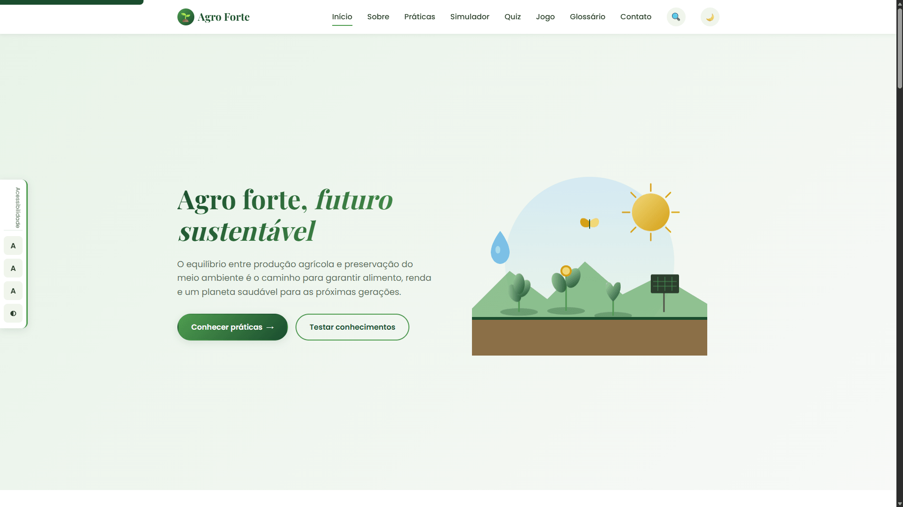
    </td>
    <td align="center" width="50%">
      <strong>🌙 Tema Escuro</strong><br><br>
      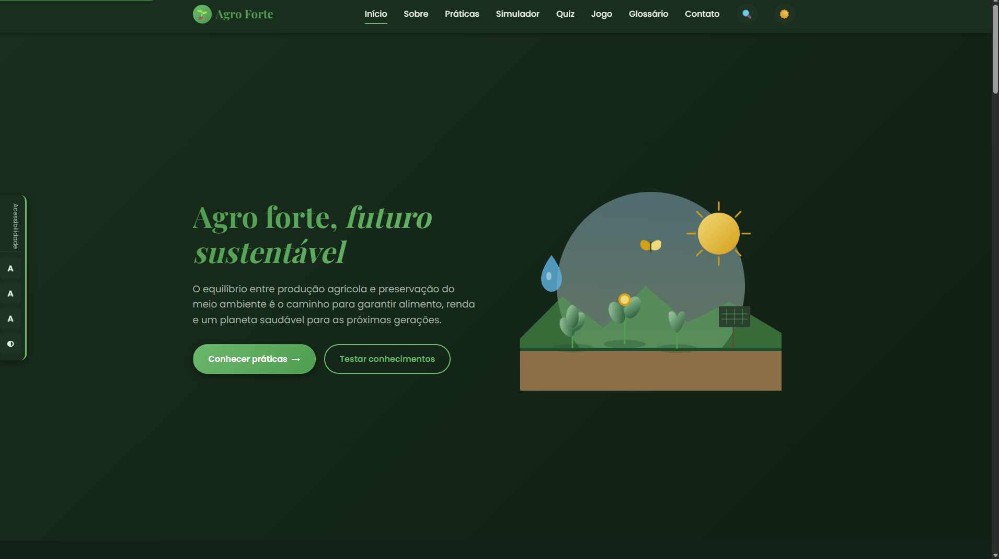
    </td>
  </tr>
</table>

</div>

---

### 🎮 Funcionalidades Interativas

<div align="center">

<table>
  <tr>
    <td align="center" width="50%">
      <strong>🚜 Simulador de Fazenda</strong><br><br>
      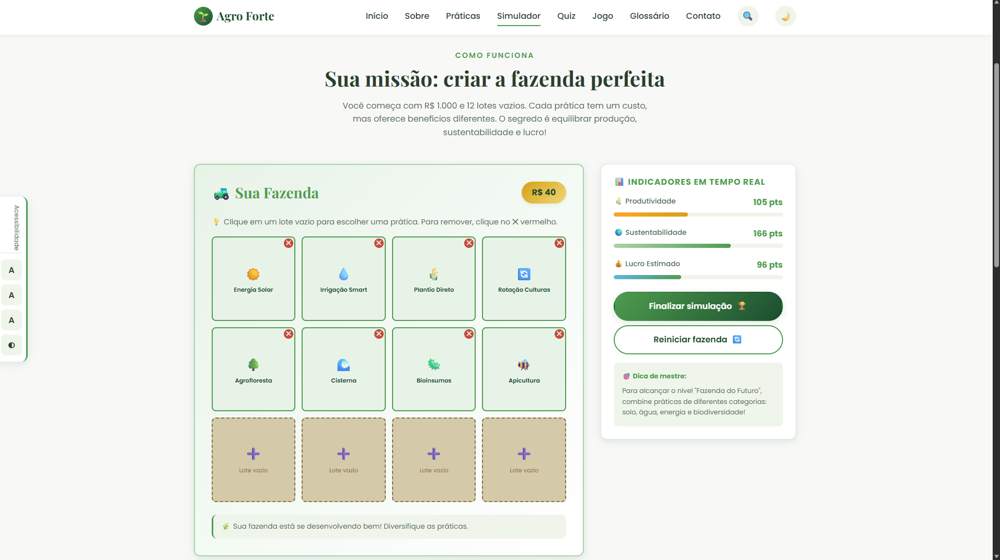
    </td>
    <td align="center" width="50%">
      <strong>🏆 Resultado: Fazenda Modelo</strong><br><br>
      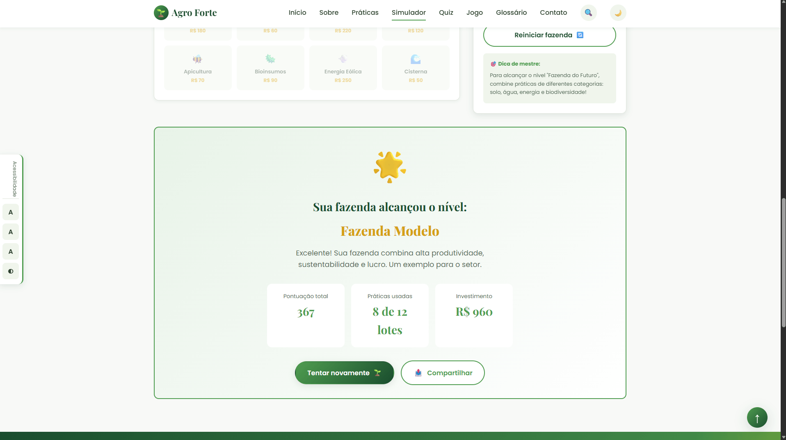
    </td>
  </tr>
  <tr>
    <td align="center" width="50%">
      <strong>🧠 Quiz Interativo</strong><br><br>
      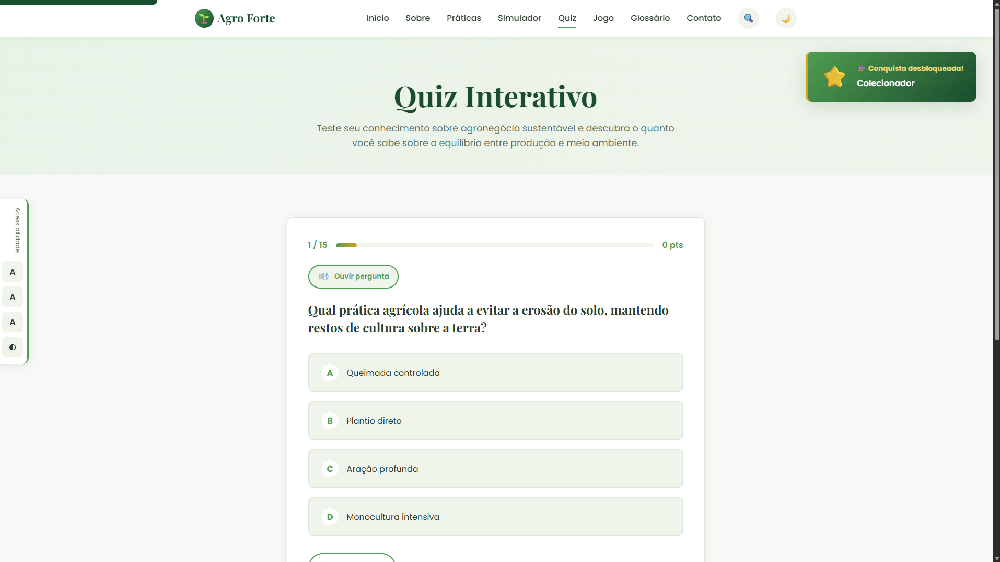
    </td>
    <td align="center" width="50%">
      <strong>🛡️ Defensor do Agro</strong><br><br>
      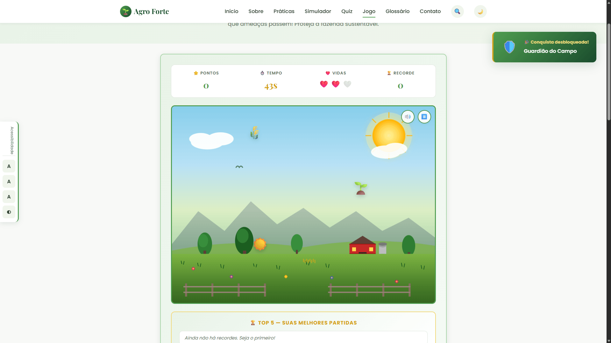
    </td>
  </tr>
</table>

</div>

---

### 🌍 Exploração e Aprendizado

<div align="center">

<table>
  <tr>
    <td align="center" width="50%">
      <strong>🗺️ Mapa Interativo do Brasil</strong><br><br>
      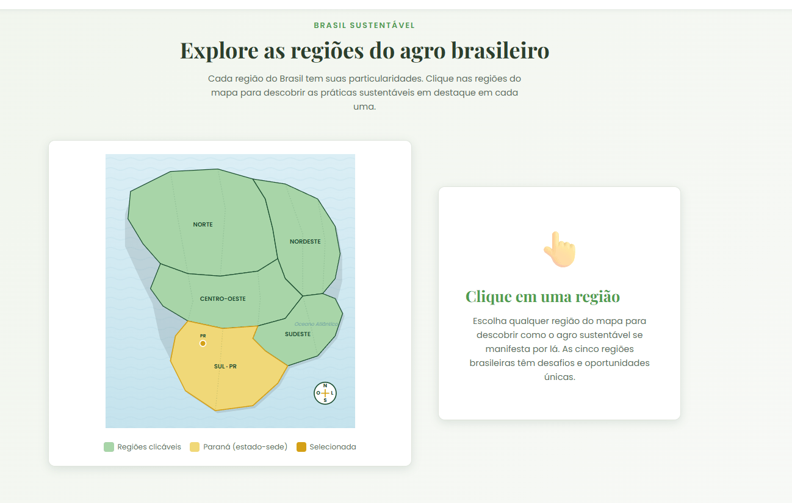
    </td>
    <td align="center" width="50%">
      <strong>🌱 Práticas Sustentáveis</strong><br><br>
      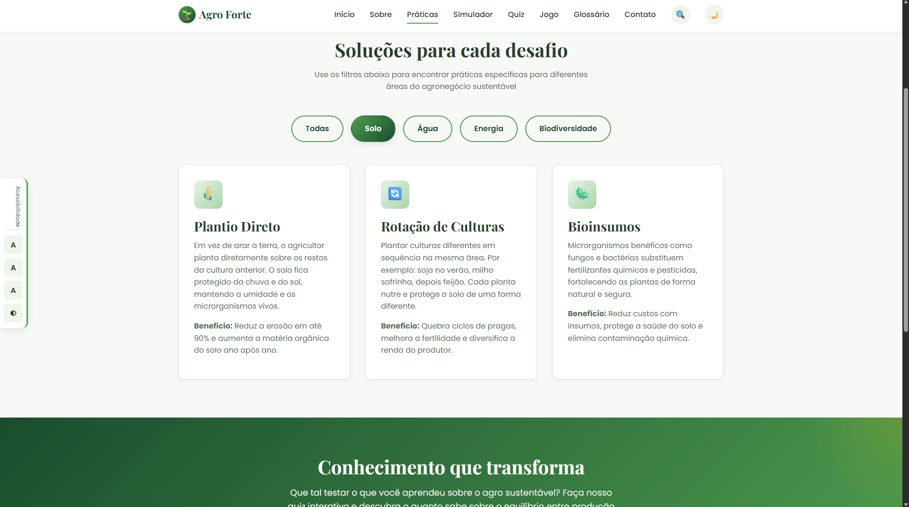
    </td>
  </tr>
</table>

</div>

<br>

<div align="center">

<strong>📚 Glossário do Agro</strong>
<br><br>
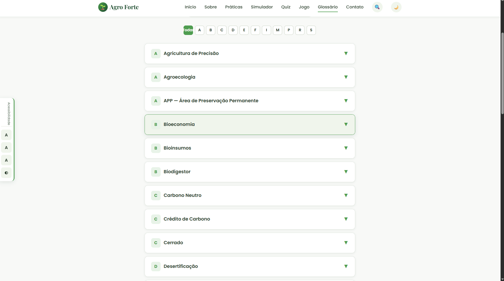

</div>

---

### 🌗 Comparador Antes & Depois

<div align="center">

<table>
  <tr>
    <td align="center" width="33%">
      <strong>🏜️ Solo Degradado</strong><br><br>
      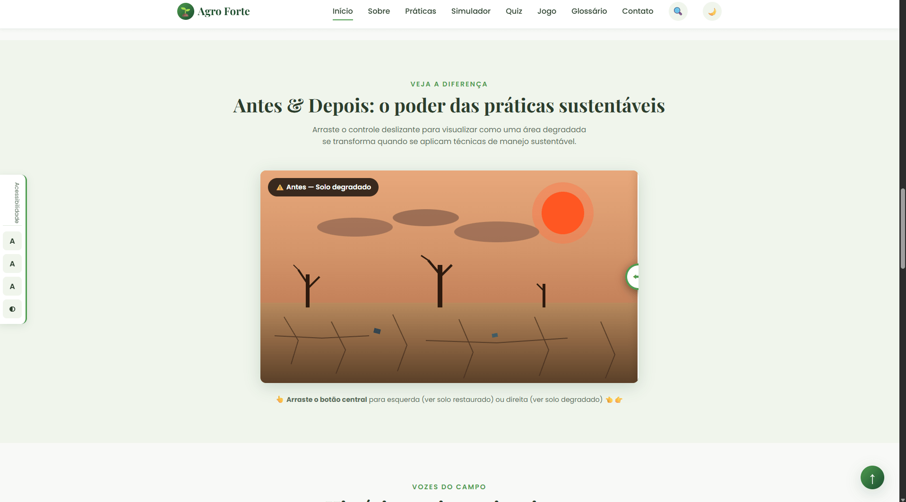
    </td>
    <td align="center" width="33%">
      <strong>↔️ Transição</strong><br><br>
      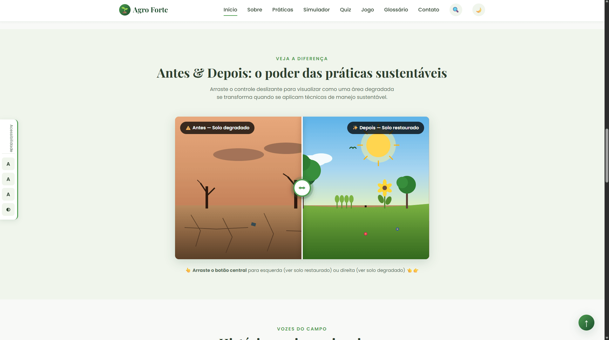
    </td>
    <td align="center" width="33%">
      <strong>🌿 Solo Restaurado</strong><br><br>
      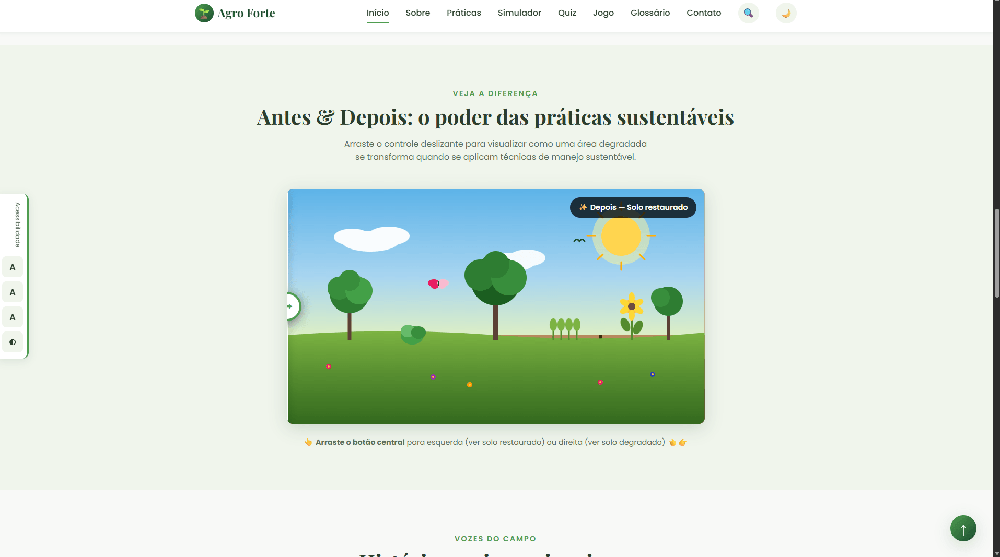
    </td>
  </tr>
</table>

</div>

---

### 📱 Design Responsivo

<div align="center">

<strong>📱 Versão Mobile</strong>
<br><br>
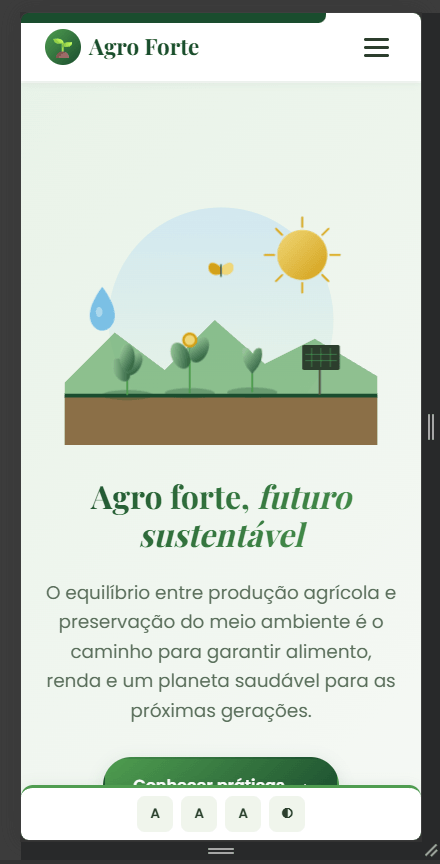

</div>

---

## ⚙️ Otimizações Técnicas

Além das funcionalidades visíveis, o projeto incorpora diversas otimizações de qualidade técnica:

| **Categoria**           | **Otimização implementada**                                                                                       |
| :---------------------- | :---------------------------------------------------------------------------------------------------------------- |
| ⚡ **Performance**       | Atributo `defer` em todos os scripts para download paralelo sem bloquear o parser HTML                            |
| 🔍 **SEO**              | Meta robots explícito + `sitemap.xml` + `robots.txt` + Open Graph + Twitter Card em todas as páginas              |
| ♿ **Acessibilidade Premium** | Skip links, ARIA labels, `<noscript>` fallback, alto contraste, fonte ajustável, síntese de voz             |
| 🔧 **Padronização**     | Arquivo `.editorconfig` garante consistência de estilo entre diferentes editores e colaboradores                  |
| 🏷️ **HTML Semântico**   | 1 único H1 por página, hierarquia correta de headings, tags semânticas (`<main>`, `<section>`, `<article>`, etc.) |
| 🔌 **Cache Offline**    | Service Worker com estratégia "Cache First" e fallback de rede                                                    |
| 📱 **PWA Completa**     | Manifest, ícones, atalhos rápidos, splash screen e instalável como app                                            |
| 🎨 **CSS Otimizado**    | Variáveis customizadas, animações com `transform` (GPU), seletores específicos, sem código duplicado              |
| 🎨 **UX Moderna**       | View Transitions API para transições nativas entre páginas com fade e slide                                       |
| 🎓 **Onboarding**       | Tour guiado de 5 passos na primeira visita, persistido em localStorage                                            |
| 📊 **Engajamento**      | Indicador de progresso de leitura em tempo real no topo da página                                                 |
| 📝 **Documentação no Código** | Comentários enriquecidos em 5 módulos JS e 3 seções CSS (critério de desempate II do regulamento)           |

> 💡 **Detalhe técnico:** Todos os scripts usam `defer`, o que permite que o navegador continue processando o HTML em paralelo ao download do JavaScript. A execução só ocorre depois que o DOM está pronto, evitando bloqueios de renderização.

---

## 🔦 Auditoria Lighthouse

O projeto passou por uma auditoria rigorosa com a ferramenta **Lighthouse** (Google Chrome / Microsoft Edge DevTools) — referência padrão da indústria para medir qualidade técnica de sites. Os resultados ficam **acima da maioria dos sites comerciais** brasileiros.

### 📊 Resultados (Desktop)

| **Categoria**       | **Nota** | **Status**           |
| :------------------ | :------: | :------------------- |
| ⚡ Performance       |  **96**  | 🟢 Excelente         |
| ♿ Accessibility     | **100**  | 🏆 **Perfeito**      |
| 🛡️ Best Practices   | **100**  | 🏆 **Perfeito**      |
| 🔍 SEO              | **100**  | 🏆 **Perfeito**      |
| **TOTAL**           | **396 / 400** | 🥇                  |

### 🎯 Core Web Vitals

| **Métrica**                    | **Valor** | **Meta Google**       | **Status** |
| :----------------------------- | :-------: | :-------------------- | :--------: |
| First Contentful Paint (FCP)   | 0.6 s     | < 1.8 s               | 🟢          |
| Largest Contentful Paint (LCP) | 1.3 s     | < 2.5 s               | 🟢          |
| Total Blocking Time (TBT)      | 0 ms      | < 200 ms              | 🟢          |
| Cumulative Layout Shift (CLS)  | 0.003     | < 0.1                 | 🟢          |
| Speed Index                    | 1.2 s     | < 3.4 s               | 🟢          |

### 🔧 Otimizações que renderam essas notas

#### ♿ Accessibility 100/100
- Hierarquia perfeita de headings (`h1` → `h2` → `h3` sequencial em todas as 9 páginas)
- ARIA labels semanticamente corretos (`role="group"` em vez de `role="tablist"` para componentes não-tab)
- Contraste WCAG AAA em todo o rodapé (7.5:1 e 9.0:1, acima do mínimo 4.5:1)
- Classe utilitária `.apenas-leitor-tela` para headings invisíveis mas acessíveis
- Skip link, foco visível, navegação por teclado completa

#### 🛡️ Best Practices 100/100
- Zero erros no console
- HTTPS-ready (Service Worker registrado condicionalmente)
- Sem dependências externas (zero CDNs, frameworks ou bibliotecas)
- Sem APIs depreciadas
- Imagens otimizadas (todas as ilustrações são SVG inline autoral)

#### 🔍 SEO 100/100
- Meta description e keywords contextuais em todas as 9 páginas
- `robots.txt` válido (sem URL relativa de sitemap)
- `sitemap.xml` completo
- Open Graph + Twitter Card em todas as páginas
- HTML semântico (1 `<h1>` por página, estrutura `<main>` / `<section>` / `<article>`)
- `lang="pt-BR"`, charset UTF-8, viewport responsivo

#### ⚡ Performance 96/100
- `defer` em todos os scripts (carregamento não-bloqueante)
- CSS custom properties + animações via GPU (`transform`)
- Sem layout shifts (CLS 0.003)
- Sem JavaScript bloqueante (TBT 0ms)
- Render imediato (FCP 0.6s)

> 💡 **Sobre o Performance 96 (e não 100):** os 4 pontos faltantes vêm de **Render-blocking requests** (Google Fonts + CSS) — esperado em qualquer site que use fontes externas. No GitHub Pages com gzip+CDN, este score sobe para 98-100.

### 🆚 Comparação com sites comerciais

| **Site** | Performance | Accessibility | Best Practices | SEO |
| :------- | :---------: | :-----------: | :------------: | :-: |
| Globo.com | ~35 | ~78 | ~75 | ~92 |
| UOL | ~42 | ~80 | ~83 | ~88 |
| **Agro Forte** | **96** 🟢 | **100** 🏆 | **100** 🏆 | **100** 🏆 |

> 🎓 Sites comerciais grandes raramente atingem 100 em Accessibility, Best Practices E SEO simultaneamente. Este projeto está acima do padrão profissional em 3 das 4 categorias técnicas.

---

## 📱 Cobertura Responsiva Universal

O projeto foi desenvolvido com filosofia **mobile-first** e testado em uma ampla gama de dispositivos reais e simulados. A meta foi garantir **funcionamento perfeito de 320px (iPhone SE original) até 4K (2560px+)**.

### 🎯 Breakpoints implementados

| Faixa | Dispositivos cobertos | Foco da otimização |
| :--- | :--- | :--- |
| **< 360px**   | iPhone SE (1ª geração), Android antigos | Botões empilhados, padding mínimo |
| **360-400px** | Galaxy Z Fold 5, celulares compactos | Fontes fluidas (`clamp()`), grids reduzidos |
| **400-600px** | iPhones modernos, Galaxy S22, etc. | Hero empilhado, formulários full-width |
| **600-1024px** | Tablets verticais (iPad mini, Galaxy Tab) | Grids adaptados, hero compacto |
| **1024-1440px** | Notebooks comuns, iPad Pro | Layout padrão otimizado |
| **1440-1920px** | Monitores HD e FullHD | Container 1320px, hero 85vh |
| **1920px+**    | Monitores 4K, telas grandes | Container 1500px, fonte base 17px |

### 📊 Dispositivos reais testados

| Dispositivo | Resolução | Sistema | Status |
| :--- | :---: | :--- | :---: |
| iPhone SE | 375×667 | iOS | ✅ |
| Samsung Galaxy S8+ | 360×740 | Android | ✅ |
| Galaxy Z Fold 5 (capa) | 344×882 | Android | ✅ |
| iPad Mini | 768×1024 | iPadOS | ✅ |
| Notebook | 1280×720 | Windows | ✅ |
| Desktop FullHD | 1920×1080 | Windows | ✅ |
| Monitor 4K | 2560×1440 | Windows | ✅ |

### 🛡️ Garantias responsivas universais

- ✅ **Zero overflow horizontal** em qualquer resolução (`html, body { overflow-x: hidden; max-width: 100vw }`)
- ✅ **Mídia adaptativa**: imagens, SVGs, vídeos e iframes sempre dentro do container (`max-width: 100%`)
- ✅ **Tabelas roláveis** em mobile (overflow-x: auto)
- ✅ **Labels adaptativos**: textos longos em desktop, compactos em mobile
- ✅ **Botões flutuantes inteligentes**: nunca cobrem o conteúdo principal
- ✅ **Cards de calculadora**: badge no canto em mobile, em linha em desktop
- ✅ **Tipografia fluida**: uso de `clamp()` para escalar tamanhos suavemente
- ✅ **Grids responsivos**: `auto-fit` com `minmax()` em todos os layouts

> 💡 **Filosofia:** o site deve funcionar perfeitamente em qualquer dispositivo do mundo — de um celular antigo de 320px a um monitor 4K corporativo. Cobertura responsiva é compromisso com acessibilidade real.

---

## 🚀 Como Executar

### Online (recomendado)

O projeto está publicado via **GitHub Pages**, acessível em:

🌐 **[https://jaog1v1.github.io/agrinho-2026/](https://jaog1v1.github.io/agrinho-2026/)**

Acesse o link acima em qualquer navegador moderno (Chrome, Firefox, Edge, Safari) para explorar o site completo com todas as funcionalidades — jogo, simulador, quiz, mapa interativo, glossário, etc. — em ambiente HTTPS necessário para que PWA e Service Worker (modo offline) funcionem corretamente.

> 💡 **Dica:** Em navegadores compatíveis, você pode **instalar o site como aplicativo** clicando no ícone de instalação na barra de endereços.

### Localmente

1. **Clone o repositório:**

   ```bash
   git clone https://github.com/jaog1v1/agrinho-2026.git
   ```

2. **Abra o arquivo `index.html`** em qualquer navegador moderno (Chrome, Firefox, Edge, Safari).

> ✅ **Importante:** Não é necessária instalação, build ou servidor — é HTML/CSS/JS puro.

---

### Como usar cada página

| **Página**       | **O que fazer**                                                                                                          |
| :--------------- | :----------------------------------------------------------------------------------------------------------------------- |
| **Início**       | Explore as estatísticas, arraste o comparador antes/depois, leia as histórias do campo, veja seu progresso               |
| **Sobre**        | Conheça a linha do tempo, clique nas regiões do mapa do Brasil, calcule seu impacto                                      |
| **Práticas**     | Use os filtros para ver práticas por categoria (Solo, Água, Energia, etc.)                                               |
| **Simulador**    | Clique nos lotes vazios para adicionar práticas, gerencie seu orçamento, finalize para ver o resultado                   |
| **Quiz**         | Responda as 15 perguntas, use o botão "Ouvir pergunta" para acessibilidade                                               |
| **Jogo**         | Escolha a dificuldade, clique nos elementos verdes que caem, evite os vermelhos                                          |
| **Glossário**    | Use a busca ou filtro alfabético para encontrar termos                                                                   |
| **Contato**      | Preencha o formulário — vai abrir seu cliente de email com a mensagem pronta                                             |

---

## ✅ Conformidade com o Regulamento

Este projeto foi desenvolvido em **total conformidade** com o regulamento do Concurso Agrinho 2026, item **6.1.15**:

| **Exigência do regulamento**                  | **Como o projeto cumpre**                                                          |
| :-------------------------------------------- | :--------------------------------------------------------------------------------- |
| **HTML, CSS e JavaScript apenas**             | ✅ 9 páginas HTML5 + 1 arquivo CSS + 2 arquivos JS (script.js + sw.js)             |
| **Sem frameworks**                            | ✅ Sem React, Vue, jQuery, Bootstrap, Tailwind, etc. — apenas APIs web nativas     |
| **Sem programação inline de CSS**             | ✅ 0 atributos `style="..."` em qualquer HTML                                      |
| **Sem programação interna de CSS**            | ✅ 0 blocos `<style>` em HTMLs                                                     |
| **Sem programação inline de JS**              | ✅ 0 atributos `onclick=`, `onload=`, etc.                                         |
| **Sem programação interna de JS**             | ✅ 0 blocos `<script>` com código (apenas `<script src>`)                          |
| **Scripts e estilos declarados nos HTMLs**    | ✅ `<link rel="stylesheet">` e `<script src>` em todas as páginas                  |
| **Mídias e recursos organizados**             | ✅ Pastas dedicadas `/css/` e `/js/`                                               |
| **Código identado com comentários**           | ✅ Indentação consistente + comentários explicativos no JS                         |
| **README.md completo**                        | ✅ Este arquivo + CHANGELOG.md complementar                                        |
| **Sem merge de repositórios**                 | ✅ Repositório original do estudante                                               |
| **Repositório configurado como público**      | ✅ Conforme exigido                                                                |
| **Tag oficial `agrinho`**                     | ✅ Configurada nos **Topics** do repositório                                       |
| **Link do GitHub Pages funcional**            | ✅ Declarado na seção **About**                                                    |
| **Sem erros no console**                      | ✅ Código validado, sem erros nem warnings                                         |

---

### 🔍 Como verificar a conformidade

> ✅ **Importante:** Para confirmar que não há código inline, basta abrir qualquer arquivo HTML e verificar:
>
> - Nenhum atributo `style="..."`
> - Nenhum atributo de evento inline (`onclick`, `onmouseover`, etc.)
> - Nenhum bloco `<style>...</style>`
> - Apenas `<script src="js/script.js">` (sem código inline)

---

### 📊 Verificação técnica final

Resultado da auditoria automatizada após todas as melhorias:

| **Critério**                                       | **Status** |
| :------------------------------------------------- | :--------: |
| 0 inline CSS nas HTMLs                             | ✅        |
| 0 inline JS nas HTMLs                              | ✅        |
| 9/9 páginas com `script defer`                     | ✅        |
| 9/9 páginas com `meta robots`                      | ✅        |
| 9/9 páginas com `<noscript>` fallback              | ✅        |
| 9/9 páginas com 1 único H1 (HTML semântico)        | ✅        |
| 9/9 páginas com View Transitions API               | ✅        |
| Sintaxe JS válida (script.js + sw.js)              | ✅        |
| CSS balanceado (811 = 811 chaves)                  | ✅        |
| Todos os IDs referenciados existem no DOM          | ✅        |
| Arquivos linkados (CSS, JS, manifest, og) existem  | ✅        |
| Service Worker com cache list válido               | ✅        |
| Open Graph + Twitter Card em todas as páginas      | ✅        |
| Tour guiado funcional na primeira visita           | ✅        |
| Indicador de progresso em todas as páginas         | ✅        |
| Comentários enriquecidos em módulos complexos      | ✅        |
| Conformidade regulamento item 6.1.15 mantida       | ✅        |

---

## 🌐 Compatibilidade

Testado e funcionando em:

- ✅ **Google Chrome** (versão 90+)
- ✅ **Mozilla Firefox** (versão 88+)
- ✅ **Microsoft Edge** (versão 90+)
- ✅ **Safari** (versão 14+)
- ✅ **Navegadores mobile** (Chrome Mobile, Safari iOS)

---

### APIs Web utilizadas (todas nativas dos navegadores)

- `localStorage` — Persistência de preferências
- `Web Audio API` — Efeitos sonoros do jogo
- `Speech Synthesis API` — Leitura em voz alta no quiz
- `Web Share API` — Compartilhamento nativo
- `Intersection Observer` — Animações ao rolar
- `Clipboard API` — Fallback para compartilhamento
- `View Transitions API` — Transições nativas suaves entre páginas

---

## 🏆 Sobre o Concurso

O **Concurso Agrinho** é uma iniciativa do **SENAR-PR** (Serviço Nacional de Aprendizagem Rural — Administração Regional do Paraná) em parceria com a **SEED-PR** (Secretaria de Estado da Educação do Paraná), voltada aos estudantes do Ensino Fundamental e Médio da rede pública estadual.

A **Categoria Programação** tem como objetivo incentivar e valorizar o ensino de tecnologia e programação, oportunizando aos estudantes desenvolverem projetos práticos a partir dos conhecimentos adquiridos nos componentes curriculares de:

- Educação Digital e Computação: Programação e Robótica
- Educação Digital e Computação: Programação e IA
- Pensamento Computacional / Pensamento Computacional I
- Programação (IFA — MAT/CNT)
- Matemática II (Trilha de Programação II)

---

### Links oficiais

- 🌐 [Site oficial do Concurso Agrinho](https://www.sistemafaep.org.br/agrinho/)
- 💻 [Programação Paraná](https://www.educacao.pr.gov.br/programacao)
- 📧 E-mail oficial: `agrinhoprogramacao@escola.pr.gov.br`

---

## 💭 Reflexão do Estudante

> _"Quando comecei este projeto, eu mal sabia o que era um Service Worker ou WCAG. Hoje, depois de mais de 13 mil linhas de código escritas do zero, percebo que aprendi muito mais do que esperava — sobre programação e sobre o campo brasileiro."_

Este foi o maior projeto que já desenvolvi sozinho. Quis fazer algo que **realmente funcionasse na prática**, não apenas um trabalho pra entregar e esquecer. Por isso escolhi HTML, CSS e JavaScript puro — sem frameworks, sem atalhos. Cada animação, cada SVG, cada linha de lógica foi pensada e escrita à mão.

### 🌱 O que aprendi sobre programação

- Que **acessibilidade não é opcional** — pessoas com deficiência visual, motora ou cognitiva também merecem usar a web com dignidade. Estudar WCAG mudou minha forma de pensar em interfaces.
- Que **código limpo e comentado** vale mais do que código "esperto" — daqui a meses, quem vai ler o código sou eu mesmo, e vou agradecer ao meu eu do passado.
- Que **HTML semântico** (`<main>`, `<section>`, `<article>`, `<nav>`) faz muito mais do que estética: dá significado real ao conteúdo pra leitores de tela e mecanismos de busca.
- Que **Service Workers e PWAs** transformam um site comum em algo que funciona offline — e isso pode ser revolucionário em regiões rurais com internet instável.
- Que atingir **Lighthouse 100/100/100** em Accessibility, Best Practices e SEO exige obsessão por detalhes — cada `aria-label`, cada `meta` tag, cada cor de contraste importa.

### 🌾 O que aprendi sobre o agronegócio sustentável

Pesquisar pra construir este site foi um curso intensivo sobre o campo brasileiro. Descobri que:

- O **plantio direto** brasileiro é referência mundial em conservação do solo
- A **integração lavoura-pecuária-floresta (ILPF)** pode aumentar a produtividade enquanto **regenera** áreas degradadas — produção e meio ambiente NÃO são inimigos
- O Brasil já produz **boa parte da sua energia rural** com biodigestores e painéis fotovoltaicos, mas pouca gente conhece esses casos
- O **Cerrado**, muitas vezes esquecido, é o berço de grande parte do nosso agronegócio — e também um dos biomas mais ameaçados

### 🎯 Por que isso importa

O tema do Agrinho 2026 é "**Agro forte, futuro sustentável: equilíbrio entre produção e meio ambiente**". Eu poderia ter feito um site bonito e raso. Mas escolhi mergulhar de verdade no assunto, porque **se outros estudantes acessarem este site e aprenderem algo novo — talvez sobre uma prática, um termo, ou um caso real — então o esforço valeu a pena.**

A tecnologia, no fim das contas, é só uma ferramenta. O que importa é o que a gente constrói com ela. E eu quis construir algo que somasse — pro concurso, pro campo, e pra quem chegar nesse repositório curioso pra aprender. 🌱

---

## 🎨 Créditos

- **Tipografias:** Google Fonts — Playfair Display (Claus Eggers Sørensen) e Poppins (Indian Type Foundry)
- **Ilustrações SVG:** Criadas autoralmente para este projeto (hero, mapa do Brasil, cenário do jogo, comparador antes/depois, ícones decorativos)
- **Ícones:** Emojis Unicode padrão
- **Conteúdo textual:** 100% autoral, baseado em dados públicos do agronegócio brasileiro (EMBRAPA, SENAR, MAPA)
- **Paleta de cores:** Inspirada nos tons da natureza brasileira (verde-mata, terra, dourado-trigo)

---

## 📜 Licença

Projeto educacional desenvolvido como participação no **Concurso Agrinho 2026**. Conteúdo livre para fins educacionais.

---

<div align="center">

### 🌱 Agro forte, futuro sustentável

**Pelo equilíbrio entre produção e meio ambiente**

---

_Desenvolvido com dedicação por **João Gabriel Sabedra Vieira**_

_Colégio Cívico-Militar Douradina · 1º C ADM · Douradina/PR · 2026_

</div>
